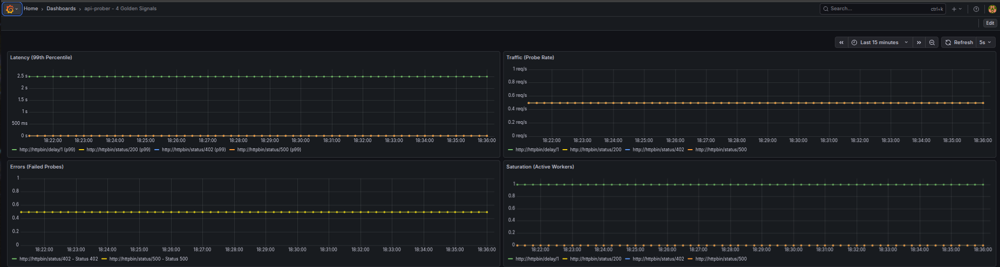
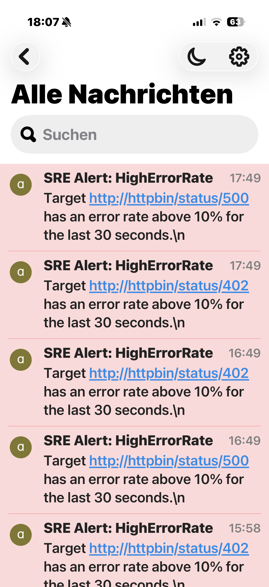
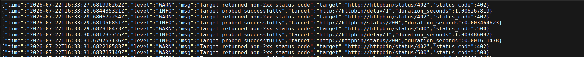
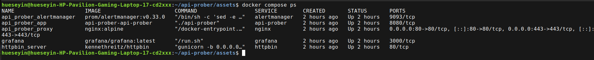

# api-prober

A cloud-native, platform-independent SRE telemetry stack written in Go. This project implements and visualizes the **4 Golden Signals** (Latency, Traffic, Errors, Saturation) for distributed edge environments.


## Features

* **Dynamic Targets:** Monitored endpoints are dynamically loaded via `targets.csv`. A native background watcher applies updates on the fly, provisioning or gracefully terminating worker goroutines without requiring application restarts.
* **Secure by Default:** Public traffic is forced through HTTPS via Nginx with automated self-signed certificate generation for local development.
* **Multi-Stage & Multi-Arch Build:** Minimal Docker footprint supporting both `amd64` and `arm64` architectures.
* **Fully Encapsulated Stack:** Self-contained environment featuring Go, Prometheus, Alertmanager, Grafana, Nginx, and Httpbin.
* **Graceful Shutdown:** Listens for termination signals (`SIGINT`, `SIGTERM`) to cleanly shut down the HTTP metric server, active workers, and dynamic target schedulers without dropping in-flight probes.

## Architecture

All services communicate within an isolated internal Docker bridge network. Public access is routed strictly through the Nginx gateway, forcing an automatic HTTP-to-HTTPS redirect for all endpoints.

```text
api-prober Architecture
│
├── Configuration Layer
│   └── targets.csv (Dynamic target config)
│
├── Core Engine (Go)
│   ├── watchTargets() (Polls targets.csv every 5s)
│   ├── Dynamic Goroutines (Spawns/cancels per target via Context)
│   └── Shared http.Client (Connection pooling & 5s timeouts)
│
├── External Endpoints
│   └── Target APIs (Probed via HTTP GET)
│
└── Observability & Diagnostics Stack
    ├── Structured Logs (JSON stdout via slog)
    ├── Go HTTP Exporter (:8080) ──> Serves /metrics & /debug/pprof
    ├── Prometheus ───────────────> Scrapes /metrics every interval
    └── Grafana ──────────────────> Queries Prometheus via PromQL
```

## 📊 Telemetry & Alerting Preview

### 4 Golden Signals Dashboard


### Emergency Mobile Pushover Alert



### Live Logging Output


### Container Health


## Getting Started

### Prerequisites

* Docker and Docker Compose
* GNU Make (optional)
* A Pushover Account (for emergency notifications)

### Secret Configuration

Before starting the stack, create a `.env` file in the root directory to store your Pushover credentials. The stack automatically injects these variables into the Alertmanager configuration at runtime via a custom entrypoint, keeping secrets out of source control:

```env
PUSHOVER_USER_KEY=your_user_key_here
PUSHOVER_API_TOKEN=your_api_token_here
```
### Installation & Lifecycle

You can manage the entire application lifecycle using the provided `Makefile`:

```bash
# View available commands
make

# Build, generate local development TLS certs, and start the Docker Compose stack
make up

# Stop all Docker Compose containers
make down

# Stop Docker Compose containers, wipe persistent data, and remove certificates
make clean

# Run Go unit and integration tests locally
make test

# Create a local k3d Kubernetes development cluster
make k3d-up

# Build the Docker image locally and load it into k3d
make k3d-build

# Apply the Kubernetes manifests from deploy/k8s/
make k3d-deploy

# Destroy the local k3d cluster and release resources
make k3d-down
```

## Configuration

* **Targets:** Define your endpoints in `targets.csv`.
* **Metrics:** Accessible securely from the outside via `https://localhost/metrics` (internally routed to `http://api-prober:8080/metrics`).
* **Dashboard:** Grafana is provisioned automatically with a pre-configured dashboard available at `https://localhost/dashboard/`.

## Alerting & Escalation

Real-time notifications are managed via Prometheus Alertmanager based on thresholds of the 4 Golden Signals.

### Emergency Priority (iOS Silent Mode Bypass)
Alerts are pre-configured with **Priority 2 (Emergency)**. To ensure critical operational alerts break through your phone's silent switch or "Do Not Disturb" focus modes:
1. Open **Settings** on your iOS device.
2. Navigate to **Pushover** -> **Notifications**.
3. Enable **Allow Critical Alerts**.

### Simulating an Alert
To verify the entire alerting pipeline from the edge to your phone, add a failing target to `targets.csv`:

```csv
http://httpbin/status/500
```
## Worker Pool Concurrency

The prober now implements a Go worker pool pattern to concurrently ping multiple API endpoints defined in the `targets.csv`. 

Instead of processing each URL sequentially, the application spins up a fixed number of worker goroutines to handle the requests in parallel. This design allows the prober to gather the four golden signals—latency, traffic, errors, and saturation—much more accurately and in real-time.

**Key Benefits:**
* **Efficiency:** Drastically reduces total probing time for large target lists.
* **Resource Management:** Prevents CPU and memory exhaustion by capping the maximum number of concurrent goroutines.
* **Scalability:** Easily handles an increasing number of endpoints without degrading performance.
* **Variables:** Change this for your desire in the docker-compose.yml
```yaml
api-prober:
    build: .
    container_name: api-prober
    restart: unless-stopped
    environment:
      # Worker pool and job queue scaling
      - WORKERS=50
      - QUEUE_SIZE=10000
      
      # HTTP connection pooling limits
      - MAX_IDLE_CONNS=1000
      - MAX_IDLE_CONNS_PER_HOST=100
      
      # Frequency of probes per target
      - PROBE_INTERVAL_SECONDS=2

      # Timeout for individual HTTP requestsa
      - HTTP_TIMEOUT_SECONDS=5

    volumes:
      - ./targets.csv:/app/targets.csv:ro
    networks:
      - monitoring
```
## Kubernetes & Local Deployment

The application runs locally inside a lightweight Kubernetes cluster managed via **k3d**, paired with the `kube-prometheus-stack` Helm chart for full observability.

* **Cluster Setup:** Spin up your local development environment using the provided deployment Makefile commands.
* **Secret Management:** Sensitive credentials—such as the Pushover `token` and `user_key`—are pulled securely at runtime from **1Password** using the 1Password CLI (`op read`) and injected directly into Kubernetes Secrets. No plain-text credentials are ever stored in version control.
```bash
  kubectl create secret generic alertmanager-secret \
    --from-literal=pushover-user-key="$(op read 'op://vault/item/user_key')" \
    --from-literal=pushover-api-token="$(op read 'op://vault/item/api_token')"
```
* **Observability Stack:** Includes Prometheus for scraping metrics, Alertmanager for notification routing, and sidecar-provisioned Grafana dashboards mapped to the local codebase.

## Troubleshooting:

Since the entire stack runs fully isolated within a custom Docker bridge network, services resolve each other directly via their service names rather than `localhost`.

If you run into too many open files errors during high-load tests, increase your OS file descriptor limit using ulimit -n (or configure LimitNOFILE= if running via systemd).

### Common Pitfalls:

1. **Targets configuration (`targets.csv`):**
   If your Go application probes services inside the stack (like `httpbin`), ensure the URLs use the container name, not `localhost`:
   ```csv
   http://httpbin/status/200
   ```

2. **Prometheus Targets (`prometheus.yml`):**
   Prometheus pulls the 4 Golden Signals directly from the Go container. The target must point to the service name defined in your compose file:
   ```yaml
   static_configs:
     - targets: ['api-prober:8080']
   ```

3. **Nginx Proxy Routes (`nginx.conf`):**
   If metrics or dashboards are unreachable from the outside, verify that your reverse proxy configuration routes traffic to the correct internal container names (`api-prober` and `grafana`) and that the local TLS certificates are mounted properly via `api_prober_proxy`.